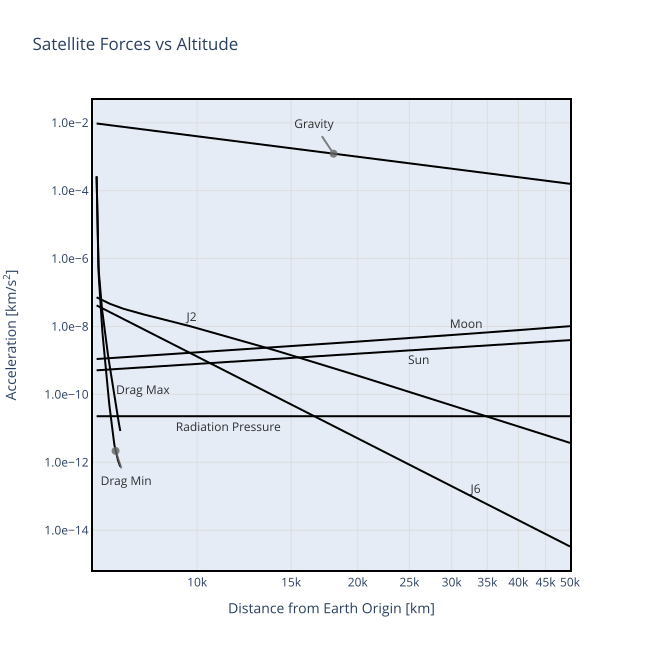

# Force Model

The `satkit` numerical propagator integrates the forces acting on a satellite to produce a change in velocity, then integrates the velocity to produce a change in position:

$$
\vec{v}(t_1)~=~\vec{v}(t_0) + \int_{t_0}^{t_1}~\vec{a}\left ( t,~\vec{p}_{t},~\vec{v}_{t} \right ) ~dt
$$

$$
\vec{p}(t_1)~=~\vec{p}(t_0) + \int_{t_0}^{t_1}~\vec{v}(t)~dt
$$

This page describes each force in $\vec{a}\left (t, \vec{p}, \vec{v}\right )$ that satkit models. The integration mechanics live in the [ODE Integrators](integrators.md) page; state vectors, the state transition matrix, and covariance propagation live in [State Vectors, STM & Covariance](satstate.md).

The force model follows the treatment in [Montenbruck & Gill (2000)](references.md#montenbruck2000), *Satellite Orbits: Models, Methods, Applications*, Chapter 3 — consult that book for more depth on any term. Every model below cites its primary source; the full list is on the [References](references.md) page.

## Summary

| Force | Default | Setting | Order of magnitude (LEO) |
|---|---|---|---|
| Earth gravity (spherical harmonics) | on | `gravity_degree`, `gravity_order`, `gravity_model` | $10^0$ m/s² |
| Sun third-body | on | `use_sun_gravity` | $10^{-6}$ m/s² |
| Moon third-body | on | `use_moon_gravity` | $10^{-6}$ m/s² |
| Atmospheric drag (NRLMSISE-00) | when alt < 700 km | `use_spaceweather`, [`satproperties.cd_a_over_m`](../api/satprop.md) | $10^{-7}$ to $10^{-3}$ m/s² |
| Solar radiation pressure (cannonball) | when `craoverm > 0` | [`satproperties.craoverm`](../api/satprop.md) | $10^{-8}$ to $10^{-7}$ m/s² |
| Solar radiation pressure (ECOM, experimental — see [Empirical SRP: ECOM](ecom.md)) | when `ecom` is set | [`satproperties.ecom`](../api/satprop.md) | $10^{-7}$ m/s² (D0), $10^{-9}$ (Y, B) |
| Solid Earth tides (IERS 2010 §6.2.1 Step 1) | on | `tide_model` | $10^{-7}$ m/s² |
| General relativity (IERS 2010 §10.3: Schwarzschild + geodesic + Lense–Thirring) | on | `use_relativistic_correction` | $10^{-9}$ m/s² (LEO) |
| Continuous thrust | when configured | [`satproperties.thrusts`](../api/satprop.md) | user-specified |

The [Forces-vs-altitude plot](#forces-vs-altitude) at the bottom of this page shows how each contribution scales with orbital altitude.

## Earth Gravity

Earth's gravity dominates by many orders of magnitude. The Earth is not a point mass; its non-spherical mass distribution is captured by an expansion in spherical harmonics with coefficients $\bar{C}_{nm}, \bar{S}_{nm}$:

$$
V(r, \phi, \lambda) = \frac{GM_\oplus}{r}\sum_{n=0}^{N}\left(\frac{R_\oplus}{r}\right)^n \sum_{m=0}^{n} \bar{P}_{nm}(\sin\phi)\left[\bar{C}_{nm}\cos m\lambda + \bar{S}_{nm}\sin m\lambda\right]
$$

The $\bar{C}_{20}$ term (commonly called **J2**) captures Earth's equatorial bulge and is responsible for orbital precession. The expansion and the recursive evaluation of the normalized Legendre functions follow [Montenbruck & Gill (2000)](references.md#montenbruck2000), §3.2, Eqs. 3.28–3.33.

Coefficient files come from [ICGEM](https://icgem.gfz.de/) ([Ince et al. 2019](references.md#ince2019)). satkit ships with four models, selectable via `gravity_model`:

| Model | Description |
|---|---|
| `egm96` | Earth Gravitational Model 1996 (default) — [Lemoine et al. (1998)](references.md#lemoine1998); tide-free |
| `jgm3` | Joint Gravity Model 3 — [Tapley et al. (1996)](references.md#tapley1996); zero-tide |
| `jgm2` | Joint Gravity Model 2 — [Nerem et al. (1994)](references.md#nerem1994); zero-tide |
| `itugrace16` | ITU_GRACE16 — [Akyilmaz et al. (2016)](references.md#akyilmaz2016); zero-tide |

The `gravity_degree` and `gravity_order` parameters cap the expansion (default 4×4). For high-precision work, degree-8 to degree-20 is typical; gains beyond ~degree-20 are small for satellites above ~500 km (satkit's recommendation — see the order-of-magnitude discussion of gravity-model truncation in [Montenbruck & Gill 2000](references.md#montenbruck2000), §3.2). Order may be set lower than degree to zero out the longitudinal (tesseral) terms.

## Third-Body Gravity (Sun, Moon)

The Sun and Moon each act as point-mass attractors. Their pull on the *Earth* must be subtracted to express acceleration in the geocentric frame:

$$
\vec{a}_\text{sun}~=~GM_\text{sun}\left[\frac{\vec{p}_\text{sun} - \vec{p}}{|\vec{p}_\text{sun}-\vec{p}|^3} - \frac{\vec{p}_\text{sun}}{|\vec{p}_\text{sun}|^3}\right]
$$

The Moon expression has the same form ([Montenbruck & Gill 2000](references.md#montenbruck2000), §3.3.1, Eq. 3.37). Body positions come from the JPL DE-series ephemerides (default DE440; [Park et al. 2021](references.md#park2021)). Disable either with `use_sun_gravity=False` / `use_moon_gravity=False`.

## Solid Earth Tides

The Sun and Moon deform the solid body of the Earth, which in turn perturbs the geopotential. satkit implements **IERS 2010 §6.2.1 Step 1** ([Petit & Luzum 2010](references.md#petit2010), Eqs. 6.6–6.7, with the anelastic Love numbers of Table 6.3) — the frequency-independent Love-number response, which in satkit's own measurements carries about 99% of the total solid-tide signal at ~5% per-step CPU overhead. The correction modifies the degree-2, degree-3, and a small degree-4 set of Stokes coefficients $\Delta\bar{C}_{nm}, \Delta\bar{S}_{nm}$ as a function of Sun and Moon ITRF positions and the IERS 2010 nominal Love numbers.

Frequency-dependent corrections (IERS 2010 §6.2.2 Step 2, Tables 6.5a–c, 71 tidal constituents) are reserved for `TideModel::SolidFull` — currently a placeholder that falls back to Step 1. The Step 2 contribution is sub-mm class at LEO.

Set with `tide_model`:

| Value | Effect |
|---|---|
| `tidemodel.solid_step1` *(default)* | IERS §6.2.1 Step 1 — recommended |
| `tidemodel.solid_full` | Step 1 + Step 2 (Step 2 not yet implemented; behaves as Step 1) |
| `tidemodel.none` | Disable solid tides (use for reproducibility with pre-tide versions) |

!!! note "Tide system of the gravity model"
    Step 1 includes the *permanent* tide, so it belongs on a **tide-free** gravity model. `gravmodel.egm96` (the default) is tide-free ($\bar{C}_{20} = -4.84165371736\times10^{-4}$); `gravmodel.jgm3` and `gravmodel.itugrace16` are **zero-tide** ($\bar{C}_{20} \approx -4.841695\times10^{-4}$), so combining them with `solid_step1` double-counts the permanent tide — about 5–7 cm cross-track over 3 days at GPS altitude. Use `egm96` with tides on, or `tidemodel.none` with a zero-tide model.

## Atmospheric Drag

At altitudes below 700 km the residual atmosphere imposes a drag force:

$$
\vec{a}_\text{drag}~=~-\frac{1}{2}\,C_d\frac{A}{m}\,\rho\,|\vec{v}_r|\vec{v}_r
$$

with $C_d$ the drag coefficient (typically 1.5–3; [Montenbruck & Gill 2000](references.md#montenbruck2000), §3.5), $A/m$ the area-to-mass ratio, $\rho$ the atmospheric density, and $\vec{v}_r$ the satellite velocity relative to the co-rotating atmosphere (assumed at rest in the Earth-fixed frame).

Density comes from the [NRLMSISE-00](https://ccmc.gsfc.nasa.gov/models/NRLMSIS~00/) thermosphere model ([Picone et al. 2002](references.md#picone2002); a pure-Rust port of Dominik Brodowski's C implementation), which reads the space-weather indices from the CelesTrak `SW-All.csv` table automatically, following the model's own interface: the observed F10.7 of the previous UTC day, the observed 81-day centred average F10.7A of the current day, and the 7-element 3-hourly geomagnetic history (the current day's daily Ap, the current 3-hourly ap and the three before it, and the 12–33 h and 36–57 h means — NRLMSISE-00 switch 9 = −1), which lets the density respond to a geomagnetic storm within hours rather than at the next UTC midnight. When that history cannot be assembled (a day missing from the table, or a monthly predicted row without 3-hourly values) the model falls back to the current day's daily Ap. Disable space-weather lookup with `use_spaceweather=False` to fall back to fixed nominal indices (F10.7 = F10.7A = 150, Ap = 4).

Drag is skipped above 700 km regardless of settings.

## Solar Radiation Pressure

Solar photons absorbed or scattered by the satellite transfer momentum, producing a force away from the Sun:

$$
\vec{a}_\text{SRP}~=~-P_\text{sun}\,C_R\frac{A}{m}\,\hat{p}_\text{sun} \cdot \nu(\vec{p}, \vec{p}_\text{sun})
$$

where $P_\text{sun} \approx 4.56 \times 10^{-6}$ N/m² is the radiation pressure at 1 AU, $C_R A/m$ is the satellite's radiation susceptibility (the user-supplied `satproperties.craoverm`), and $\nu(\vec{p}, \vec{p}_\text{sun}) \in [0, 1]$ is a shadow function that vanishes when the satellite is in Earth's umbra — the conical umbra/penumbra model of [Montenbruck & Gill (2000)](references.md#montenbruck2000), §3.4.2; the cannonball force itself is their §3.4, Eq. 3.75.

satkit's default is a **cannonball model** — the satellite's surface is treated as if its normal points toward the Sun, and the force acts along the satellite→Sun line. A physical box-wing model ([Rodriguez-Solano et al. 2012](references.md#rodriguez2012)) is not provided.

For GNSS-class work satkit also offers the **Empirical CODE Orbit Model (ECOM)** — the empirical, Sun-oriented D/Y/B parameterization used by CODE and most IGS analysis centres — as an **experimental** addition to the cannonball term, enabled by supplying coefficients through `satproperties(ecom=...)`. Its equations, coefficient table, sign and eclipse conventions, and measured performance are on the [Empirical SRP: ECOM](ecom.md) page.

Moon geometry and quadruples the fit residual. And for arcs that cross Earth's shadow, use `integrator = gauss_jackson8`: the adaptive Runge–Kutta steppers can abort at a shadow boundary with *too many consecutive step rejections*, whereas the fixed-step multistep integrator is immune and fits an eclipsing satellite just as well (G08, 8% umbra: 4.7 cm fit, 5.6 cm at 24 h).

## General-Relativistic Correction

The full IERS 2010 §10.3 Eq. 10.12 correction ([Petit & Luzum 2010](references.md#petit2010)) with PPN parameters $\beta = \gamma = 1$, three terms:

$$
\vec{a}_\text{GR}~=~\underbrace{\frac{GM_\oplus}{c^2 r^3}\left[\left(\frac{4GM_\oplus}{r} - v^2\right)\vec{r} + 4(\vec{r}\cdot\vec{v})\vec{v}\right]}_\text{Schwarzschild}
~+~\underbrace{2\,\vec{\Omega}\times\vec{v}}_\text{geodesic}
~+~\underbrace{\frac{2GM_\oplus}{c^2 r^3}\left[\frac{3}{r^2}(\vec{r}\times\vec{v})(\vec{r}\cdot\vec{J}) + \vec{v}\times\vec{J}\right]}_\text{Lense–Thirring}
$$

where $\vec{\Omega} = \tfrac{3}{2}\,\frac{GM_\odot}{c^2 R_\oplus^3}\,(\vec{R}_\oplus\times\dot{\vec{R}}_\oplus)$ is the geodesic (de Sitter) precession of the geocentric frame from the Earth's heliocentric state $\vec{R}_\oplus, \dot{\vec{R}}_\oplus$ ($|\Omega| \approx 1.92''$/century), and $\vec{J} = \tfrac{2}{5}R^2\omega\,\hat{z}_\text{ITRF}$ is the Earth's spin angular momentum per unit mass (homogeneous rigid-sphere approximation, $\approx 1.19\times10^9$ m²/s; the real moment-of-inertia factor is ≈0.33 rather than 0.4, a ~20% overstatement of a term that is ≤$10^{-10}$ m/s² and mostly periodic — GMAT uses the same approximation, [GMAT Mathematical Specifications](references.md#gmatspec), §4.2.6).

The Schwarzschild term dominates below GEO (~$10^{-9}$ m/s² at LEO; in satkit runs, omitting it costs ~1 m/day at GPS altitude and ~3 m/day at GEO). The geodesic term is a near-constant $4\times10^{-11}$ m/s² Coriolis-like acceleration at LEO and becomes the largest relativistic term beyond ~100,000 km (~1 m over 7 days at 200,000 km, measured in the [GMAT comparison](gmat_validation.md)). Lense–Thirring is ~$10^{-10}$ m/s² at LEO, mostly periodic, and falls as $1/r^3$. This is the same formulation as GMAT's `RelativisticCorrection` ([GMAT Mathematical Specifications](references.md#gmatspec), §4.2.6).

Toggle with `use_relativistic_correction` (default `True`).

## Continuous Thrust

Constant acceleration in a chosen frame (used to model low-thrust maneuvers or — in orbit-determination contexts — *empirical accelerations*: a fitted catch-all that absorbs un-modeled physics). See [`satkit.thrust`](../api/satprop.md) and the [GPS Example tutorial](../tutorials/GPS Example.ipynb) for usage.

## Future Propagation

When propagating into the future beyond the date range of downloaded data files:

- **Earth Orientation Parameters** ($\Delta UT1$, $x_p$, $y_p$): the last available values are held constant, with a one-time warning. This is much more accurate than defaulting to zero, but still drifts by ~0.1″ / ~10 ms over a few months (metres at LEO); check `satkit.frametransform.eop_status(t)` or set `propsettings.require_eop_coverage = True` to make the propagator raise instead, and refresh with `satkit.utils.update_datafiles()`. A propagation with no EOP table loaded at all is refused.
- **Space Weather** (F10.7 solar flux, Ap geomagnetic index): if historical data isn't available, the [NOAA/SWPC solar cycle forecast](https://www.swpc.noaa.gov/products/solar-cycle-progression) supplies predicted F10.7 (out ~5 years). Ap defaults to 4. If neither source is available, F10.7 = 150 and Ap = 4 are used. Run `satkit.utils.update_datafiles()` to refresh both.

## Forces vs Altitude

The plot below, modeled on Fig. 3.1 of [Montenbruck & Gill (2000)](references.md#montenbruck2000), shows each force's order of magnitude vs orbital altitude:

## See Also

- **Tutorial**: [GPS Example](../tutorials/GPS Example.ipynb) — fits a GPS orbit against ESA SP3 truth and walks through the empirical-acceleration concept.
- **Theory**: [ODE Integrators](integrators.md) for the integration mechanics; [State Vectors, STM & Covariance](satstate.md) for state representation and covariance propagation.
- **Validation**: [GMAT Comparison](gmat_validation.md) — how this force model agrees with NASA GMAT across seven orbital regimes, and which terms account for the remaining differences.
- **API**: [`satkit.propagate`](../api/satprop.md), [`satkit.propsettings`](../api/satprop.md), [`satkit.satproperties`](../api/satprop.md).
- **References**: the sources for every model on this page are collected on the [References](references.md) page.
