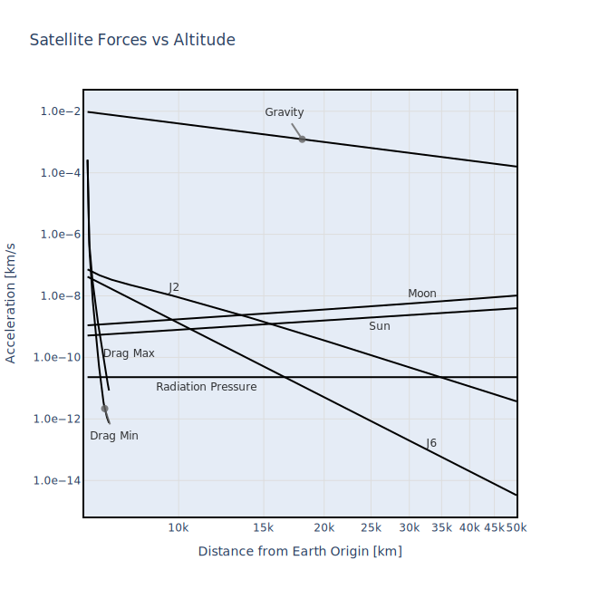

# High-Precision Orbit Propagation

The `satkit` package includes a high-precision orbit propagator, which predicts future (and past) positions and velocities of satellites by integrating the known forces acting upon the satellite.

The propagator and force models follow very closely the excellent and detailed description provided in the book [**"Satellite Orbits: Models, Methods, Applications"**](https://doi.org/10.1007/978-3-642-58351-3) by O. Montenbruck and E. Gill. A brief description is provided below; for more detail please consult this reference.

The propagator, like the rest of the package, is written natively in [Rust](https://www.rust-lang.org). This includes both the force model and the Runge-Kutta ODE integrator. This allows the propagator to run extremely fast, even when being called from Python.

## Mathematical Description

The orbit propagator integrates the forces acting upon the satellite to produce a change in velocity, then integrates the velocity to produce a change in position. Mathematically, this is:

$$
\vec{v}(t_1)~=~\vec{v}(t_0) + \int_{t_0}^{t_1}~\vec{a}\left ( t,~\vec{p}_{t},~\vec{v}_{t} \right ) ~dt
$$

$$
\vec{p}(t_1)~=~\vec{p}(t_0) + \int_{t_0}^{t_1}~\vec{v}(t)~dt
$$

where $\vec{p}(t)$ and $\vec{v}(t)$ are the position and velocity vectors, respectively, of the satellite, and $\vec{a}\left (t,~\vec{p}(t),~\vec{v}(t) \right )$ is the acceleration vector, which is simply the forces acting upon the satellite (a function of time and satellite position & velocity) divided by the satellite mass.

## Modelled Forces

For a ballistic satellite orbiting the Earth, the forces acting upon the satellite are accurately known. These are:

### Earth Gravity

The Earth's gravity is the largest force acting on the satellite. For simpler Keplerian orbit models, the Earth is approximated as a point mass, which is valid if the Earth were spherical with a constant density. However, the Earth actually has a much more complex shape. The force of gravity is computed by taking an expansion of Legendre polynomials with coefficients determined by shape and density of the Earth. For example, the Earth bulges at the center, creating extra mass that pulls inclined orbits toward the equator and causes *precession*. This is commonly known as the **J2** term in the Legendre expansion.

Multiple experiments have attempted to measure the Legendre coefficients for Earth gravity. The University of Potsdam maintains a catalog of gravity models [here](https://icgem.gfz-potsdam.de/home). The `satkit` package is able to compute gravity using several of the models published at this site with a user-settable degree of accuracy.

### Solar Gravity

The sun acts as a point mass pulling the satellite toward it. The sun also pulls the earth towards it, so the force from the sun produces an acceleration in the geocentric frame that must be subtracted from the acceleration due to the Earth:

$$
\vec{a}~=~GM_{sun}~\left [ \frac{\vec{p} - \vec{p}_{sun}}{|\vec{p} - \vec{p}_{sun}|^3}  - \frac{\vec{p}_{sun}}{|\vec{p}_{sun}|^3} \right ]
$$

where $G$ is the gravitational constant, $M_{sun}$ is the mass of the sun, and $\vec{p}_{sun}$ is the position of the sun.

### Lunar Gravity

The moon, like the sun, acts as a point mass pulling the satellite towards it, and the expression for the acceleration of the satellite due to the moon is very similar to above:

$$
\vec{a}~=~GM_{moon}~\left [ \frac{\vec{p} - \vec{p}_{moon}}{|\vec{p} - \vec{p}_{moon}|^3}  - \frac{\vec{p}_{moon}}{|\vec{p}_{moon}|^3} \right ]
$$

where $G$ is the gravitational constant, $M_{moon}$ is the mass of the moon, and $\vec{p}_{moon}$ is the position of the moon.

### Drag

At about 600km altitude and below, there is enough atmosphere to impose a drag force on the satellite. The force takes a standard form:

$$
\vec{a}~=~-\frac{1}{2}~C_d~\frac{A}{m}~\rho~\vec{v}_r~|\vec{v}_r|
$$

where $C_d$ is the unitless coefficient of drag (generally a number between 1.5 and 3), $A$ is the satellite cross-sectional area, $m$ is the mass, $\rho$ is the air density, and $\vec{v}_r$ is the satellite velocity relative to the surrounding air (which is generally assumed to be zero in the *Earth-fixed* frame). The propagator uses the [NRL-MSISE00](https://ccmc.gsfc.nasa.gov/models/NRLMSIS~00/) density model, and includes space weather effects.

### Solar Radiation Pressure

Momentum transfer to the satellite from solar photons that are scattered or absorbed adds an additional force:

$$
\vec{a}~=~-P_{sun}~\cos(\theta)~\frac{A}{m}\left [ (1-\epsilon) \hat{p}_{sun} + 2 \epsilon \cos(\theta) \hat{n} \right ]
$$

where $P_{sun}\approx 4.56\cdot10^{-6}~Nm^{-2}$ is the solar radiation pressure in the vicinity of the Earth, $A\cos(\theta)$ is the cross-section of the satellite illuminated by the sun ($\theta$ is the incidence angle), $\epsilon$ is the fraction of light scattered by the satellite (1-$\epsilon$ is absorption), $m$ is the satellite mass, and $\hat{n}$ is the half-angle between the incoming and reflected rays. The propagator includes an additional computation that considers if the sun is shadowed by the Earth. Satellite surfaces can be complex, so the most-accurate representation of the expression above would integrate $dA \cos(\theta)$ over the full cross-sectional area.

The `satkit` package greatly simplifies the above expression by assuming that the surface normals all point in the direction of the sun (this is *mostly* true for active satellites that have large solar panels pointed at the sun). The expression above is then simplified:

$$
\vec{a}~=~-P_{sun}~C_R\frac{A}{m}\hat{p}_{sun}
$$

To include this force, the user sets a static $C_R\frac{A}{m}$ value in the `satproperties_static` object used in the propagation. The integrator takes care of computing the sun position and Earth occlusion.

## Un-modeled Forces

The high-precision propagator does not include several additional forces that are generally small. These include:

- Solid tides of the Earth
- Radiation pressure of Earth albedo
- Gravitational force of other planets
- Relativistic effects

## ODE Solver

The high-precision propagator makes use of adaptive Runge-Kutta methods for integrating the equations of motion, with embedded error estimation for automatic step-size control. A proportional-integral-derivative (PID) controller adjusts the step size to keep errors within user-defined bounds. The Butcher tableaux are provided by the *delightful* web page of [Jim Verner](https://www.sfu.ca/~jverner/).

### Integrator Choices

Several integrators are available, selected via the `integrator` parameter of `propsettings`:

| Integrator | Order | Stages | Dense Output | Notes |
|---|---|---|---|---|
| `rkv98` | 9(8) | 26 | 9th-order | Default. Best accuracy for precision work. |
| `rkv98_nointerp` | 9(8) | 16 | None | Same stepping accuracy, faster when interpolation is not needed. |
| `rkv87` | 8(7) | 21 | 8th-order | Good balance of speed and accuracy. |
| `rkv65` | 6(5) | 10 | None | Faster, moderate accuracy. |
| `rkts54` | 5(4) | 7 | None | Fastest. Good for quick propagations. |
| `rodas4` | 4(3) | 6 | None | L-stable Rosenbrock (implicit). For stiff problems. No STM support. |

Higher-order integrators can take larger time steps for the same accuracy, so despite more stages per step, they often require fewer total function evaluations. For most orbit propagation tasks, the default `rkv98` is recommended. For stiff problems (re-entry, very low perigee), `rodas4` uses an implicit method with analytical Jacobian.

```python
import satkit as sk

# Use the faster Tsitouras 5(4) integrator
settings = sk.propsettings(integrator=sk.integrator.rkts54)

# Use the 8(7) integrator with EGM96 gravity
settings = sk.propsettings(
    integrator=sk.integrator.rkv87,
    gravity_model=sk.gravmodel.egm96,
    gravity_degree=16,
)

# Use RODAS4 for a very low orbit with high drag
# (implicit solver handles stiff dynamics from rapid density changes)
settings = sk.propsettings(
    integrator=sk.integrator.rodas4,
    gravity_degree=8,
)
satprops = sk.satproperties_static(cd_a_over_m=2.2 * 0.01 / 1.0)
```

!!! note
    The `rodas4` integrator does not support dense output interpolation or
    state transition matrix propagation (`output_phi=True`).  Attempting
    to use `output_phi=True` with `rodas4` will raise a `RuntimeError`.

### Gravity Model Selection

The gravity model used in propagation can be selected via the `gravity_model` parameter. Available models are:

| Model | Description |
|---|---|
| `jgm3` | Joint Gravity Model 3 (default) |
| `jgm2` | Joint Gravity Model 2 |
| `egm96` | Earth Gravitational Model 1996 |
| `itugrace16` | ITU GRACE 2016 |

The `gravity_degree` and `gravity_order` parameters control the maximum degree and order of the spherical harmonic expansion.

## Future Propagation

When propagating into the future (beyond the date range of downloaded data files), the following behavior applies:

- **Earth Orientation Parameters** ($\Delta UT1$, $x_p$, $y_p$): The last available values from the EOP file are used (constant extrapolation). This is much more accurate than defaulting to zero, since these parameters change slowly.

- **Space Weather** (F10.7 solar flux, Ap geomagnetic index): When historical space weather data is not available, the [NOAA/SWPC solar cycle forecast](https://www.swpc.noaa.gov/products/solar-cycle-progression) is used for predicted F10.7 values (out ~5 years). The Ap geomagnetic index is not included in the forecast and defaults to 4. If neither source is available, fixed defaults are used (F10.7 = 150, Ap = 4). Run `satkit.utils.update_datafiles()` to download the latest forecast.

## State Transition Matrix

The state transition matrix, $\Phi$ describes the partial derivative of the propagated position and velocity with respect to the initial position and velocity:

$$
\Phi~=~\frac{\partial (\vec{p},\vec{v})}{\partial (\vec{p}_0,\vec{v}_0)}
$$

This 6x6 matrix can be computed by numerically integrating the partial derivatives of the accelerations described above, and is useful for "propagating" the 6x6 state covariance, via the equation below. Details for computing $\Phi$ are found in Montenbruck & Gill.

$$
\sigma^2_{p,v}~=~\Phi~\sigma^2_{p_0,v_0}~\Phi^T
$$

The state transition matrix is also useful when estimating a satellite state from a series of observations (e.g., radar or optical).

The `satkit` package includes the option to compute the state transition matrix when solving for the new state.

## Forces vs Altitude

The plot below, modeled on a similar plot in Montenbruck and Gill, gives a sense of the various contributors to satellite acceleration as a function of altitude:


