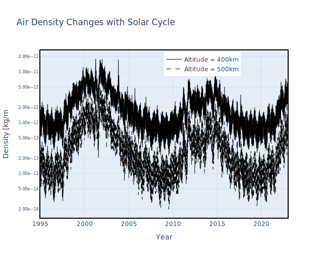

# Air Density 

For satellites below about 600 km, the drag force can be a significant contributor to the orbital state.

The drag force is given by:

$$
\vec{a}_d~=~-\frac{1}{2}~C_d~\frac{A}{m}~\rho~\vec{v}_r~|\vec{v}_r|
$$

With the following definitions:
* $\vec{a}_d$  : acceleration due to drag
* $C_d$  : Coefficient of Drag.  This is a function of the material propertis of the satellite, and is generally in the range [1,3].
* $A$  : Area of satllite normal to the drag force
* $m$  : Mass of satellite
* $\rho$  : Air Density
* $\vec{v}_r$  : Velocity of satellite relative to the surrounding air


## Air Density Model

There are multiple models describing the air density.  The ``satkit`` package uses the [NRL MSISE-00](https://ccmc.gsfc.nasa.gov/models/NRLMSIS~00/) empirical air density model that predicts density as a function of altitude, latitude, longitude, and solar activity. The solar radio flux at 10.7 cm wavelength (2800 MHz) is used as an indicator of solar activity in the model.  The flux is measured multiple times a day and recorded in a "space weather" file that is downloaded on-demand by the ``satkit`` package.

```{Note}
The air density at altitudes of low-Earth orbiting satellites is a **strong** function of space weather.  Solar activity varies in cycles with an 11-year period.  Variations in solar activity can produce changes in air density larger than an order of magnitude.
```

